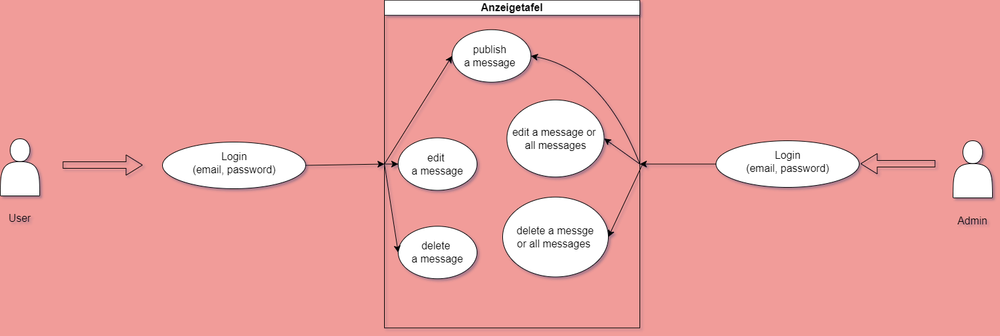
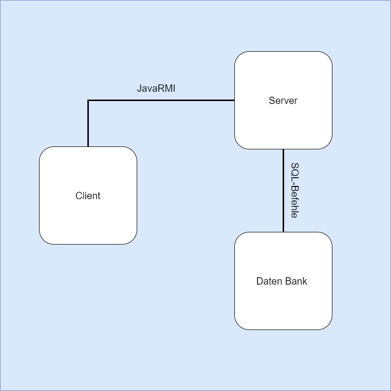
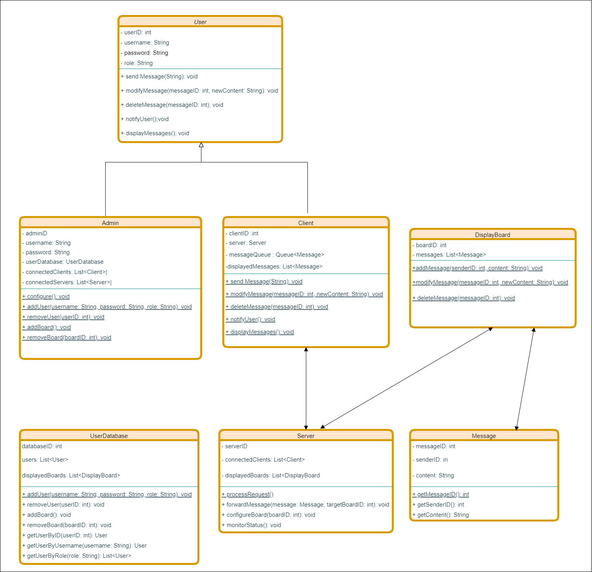
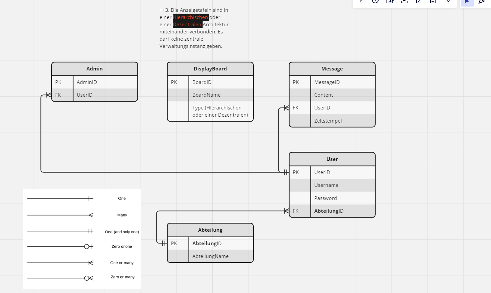
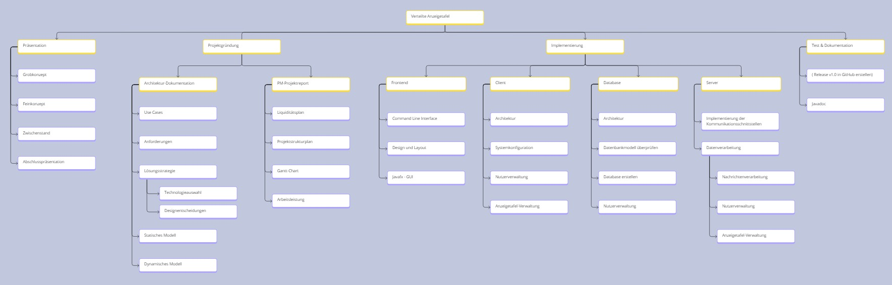
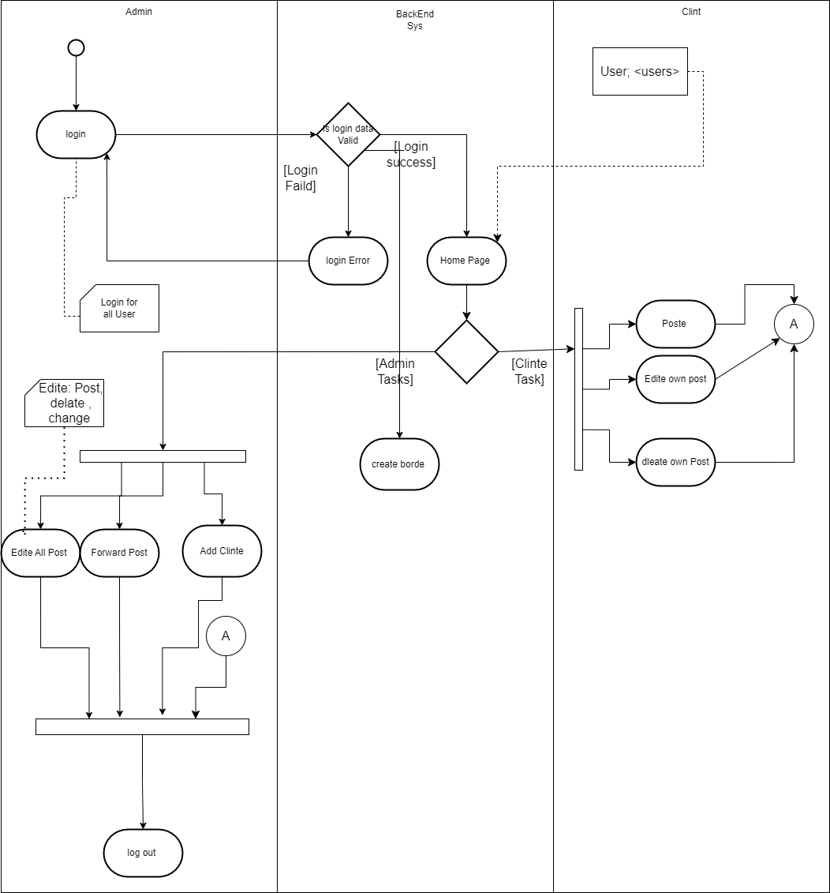
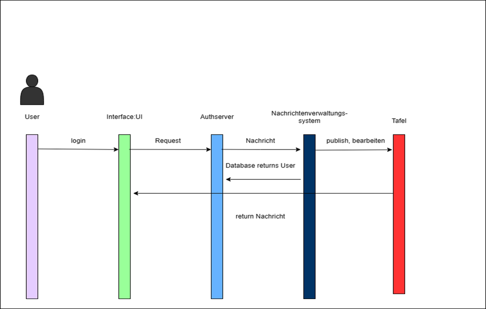

# Verteilter-Anzeigetafel

Dies ist ein abschließendes Gruppenprojekt im Rahmen der Vorlesung Verteilte Systeme im fünften Semester. Unsere Aufgabe ist es, einen verteilte Anzeigetafeln verwaltet werden. Jede Tafel wird von einer lokalen Nutzergruppe genutzt. Jeder Nutzer dieser Gruppe darf eine Nachricht auf seine Gruppentafel publizieren, modifizieren und löschen (natürlich nur die eigenen).
Dieses Projekt wurde ursprünglich auf dem HTW GitLab entwickelt.

## Architektur

Unser Verteilter-Anzeigetafel-System besteht aus einer Architektur, die mehrere Server umfasst. Diese Server repräsentieren digitale Anzeigetafeln in einem verteilten Netzwerk. Die Interaktion zwischen den Clients und den Servern ermöglicht es den Benutzern, Informationen abzurufen oder zu aktualisieren. Ein zentraler Server oder eine zentrale Anzeigetafel hat das Hauptziel, alle Anzeigetafeln zu verbinden und das Gesamtsystem einfach zu verwalten. Dadurch können Nachrichten von einer Anzeigetafel an andere weitergeleitet werden.

Die Architektur des Systems basiert auf der Verwendung von Microservices, was Flexibilität innerhalb einzelner Services, Skalierbarkeit und eine geringe Kopplung im gesamten System ermöglicht. Neue Anwendungskomponenten können nach Bedarf hinzugefügt werden. Im Falle eines Ausfalls oder Fehlers eines Services sind die anderen nicht betroffen, da sie unabhängig voneinander operieren. Jedes Modul erfüllt dabei seine eigene spezifische Aufgabe.

## Technologiestack:

* [GitLab](https://gitlab.com/) - Version Control 
* [Java Spring](https://spring.io/) - Vereinfacht die Entwicklung mit Microservices und automatisiert die Konfiguration neuer Abhängigkeiten.
* [Maven](https://maven.apache.org/) - Dependency Management
* [JavaFX](https://openjfx.io/) - für die Benutzeroberfläche der Anwendung
* [SceneBuilder](https://gluonhq.com/products/scene-builder/) - Vereinfachung von JavaFX-Views
* [MySQL](https://www.mysql.com/de/) - Datenbank
* [Java RMI]([https://www.rabbitmq.com/](https://docs.oracle.com/javase/8/docs/technotes/guides/rmi/hello/hello-world.html)) - Remote Object
* [Swagger](https://jwt.io/) - Dokumentation
* [H2 Database](https://www.h2database.com/html/main.html) - Datenbankmanagement

## Interaktion mit dem API-Gateway:
Die Kommunikation des Clients erfolgt über HTTP mit dem API-Gateway, das als Einfahrt für alle Requests außerhalb der Microservices dient.

## Datenmanagement-Ansatz:
Für die Datenhaltung kommt MySQL zum Einsatz, unterstützt durch das Hibernate ORM-Framework. Diese Kombination ermöglicht eine effiziente und unkomplizierte Verwaltung der Datenbank.

### Ablauf der Systemimplementierung:

* Registrierung der Server:
Jeder Server registriert ein eigenes Remote-Objekt mit einem eindeutigen Namen in der Java RMI-Registry.

* Client-Server-Verbindung:
Clients suchen in der RMI-Registry nach Servernamen, um Verbindungen zu bestimmten Anzeigetafeln herzustellen.

* Befehlsübertragung:
Clients senden Befehle über die etablierte Verbindung an die Server, um Aktionen auf den Anzeigetafeln auszuführen.

* Serverseitige Logik:
Die serverseitige Logik verarbeitet Anfragen und führt Aktualisierungen der Anzeigetafelzustände durch. 

#### Use Case Diagramm

#### Anforderungen

* ++1. Client und Server müssen asynchron kommunizieren.
* ++2. Es muss eine Three-Tier-Architektur umgesetzt werden, bei der die Datenbank auf einen eigenen Rechner ausgelagert wird.
* ++3. Die Anzeigetafeln sind in einer Hierarchischen oder einer Dezentralen Architektur miteinander verbunden. Es darf keine zentrale Verwaltungsinstanz geben.

###### Must-have:
* Nutzer einer Anzeigetafel müssen in der Lage sein über einen Nutzer-Client Nachrichten auf der eigenen Anzeigetafel zu publizieren, zu modifizieren und zu löschen (natürlich nur die eigenen).
* Koordinatoren einer Anzeigetafel müssen in der Lage sein alle Nachrichten zu manipulieren und einzelne Nachrichten an andere Anzeigetafeln weiterzuleiten.
* Über einen Admin-Client müssen Administratoren das System konfigurieren und administrieren können. Insbesondere muss es möglich sein Nutzer zu verwalten und Anzeigetafeln hinzuzufügen bzw. zu entfernen.
* Um den Zugriff auf die Anzeigetafeln nur registrierten Nutzern zu erlauben, muss es eine Nutzerverwaltung geben.
* Die Client-Anwendung und der Admin-Client müssen über ein Command Line Interface verfügen.

###### Schould-Have:
* Anfragen an den Anzeigetafel-Service müssen parallel in eigenen Prozessen oder Threads behandelt werden.
* Der Zustand der Anzeigetafeln muss persistent in einer Datenbank gespeichert und nach einem Serverabsturz wiederhergestellt werden.
* Über den Admin-Client muss es möglich sein den Status der Anzeigetafeln zu überwachen und Statistiken abzurufen.
* Nutzer müssen über den Nutzer-Client aktiv informiert werden, wenn neue Nachrichten auf der eigenen Tafel vorliegen.

###### Could-Have:
* Der Anzeigetafel-Service muss horizontal skalierbar sein.
* Nachrichtenverluste müssen erkannt und automatisch behandelt werden.
* Es müssen Logdateien geschrieben werden, die es dem Administrator ermöglichen alle Zugriffe auf den Anzeigetafel-Service nachzuvollziehen.
* Über einen Heartbeat-Mechanismus muss periodisch geprüft werden, ob alle Anzeigetafeln noch verfügbar sind.
* Der Nutzer-Client und der Admin-Client müssen über ein Graphisches User Interface verfügen.

#### Statisches Modell

###### Komponentendiagramm

###### Verteilungsdiagramm

###### Klassendiagramm

###### Datenbankmodell 

###### Projektstrukturplan 

#### Dynamisches Modell

###### Aktivitätsdiagramm

###### Sequenzdiagramm

## Anleitung zur Einrichtung der PostgreSQL-Datenbank für die Anzeigetafelanwendung

### Herunterladen von PostgreSQL

1. Besuchen Sie die offizielle PostgreSQL-Website unter: [PostgreSQL-Downloads](https://www.enterprisedb.com/downloads/postgres-postgresql-downloads).
   
2. Laden Sie die Version 16.2 herunter, die wir für diese Anwendung verwendet haben.

### Konfiguration der Datenbank

- Verwenden Sie das Passwort "123456", oder wählen Sie ein anderes, müssen Sie jedoch das Passwort in den Dateien `App\server\src\main\resources\application.properties` und `App\database\src\main\resources\application.properties` ändern.

- Der Standardport für PostgreSQL ist 5432. Falls Sie diesen ändern, passen Sie auch den Port in der Datei `application.properties` an.

- Während der Installation über den Stack Builder aktivieren Sie die Option für den pgJDBC-Treiber.

- ### Neu Starten

- Vergessen Sie nicht, nach der Installation oder Änderung der Konfigurationen PostgreSQL neu zu starten.

- Überprüfen Sie, ob die Anwendung eine Verbindung zur Datenbank herstellen kann. Sollte dies nicht der Fall sein, können Sie pgAdmin4 starten und einen neuen Server mit den Informationen aus `application.properties` erstellen. Achten Sie besonders auf den Host (localhost), den Port (5432) und dasselbe Passwort, das Sie in `application.properties` festgelegt haben.

### Server starten

1. Starten Sie die Datei `ServiceRegistrar.java` unter `App\server\src\main\java\com\htwsaar\anzeigetafel\server\registrarservice`. Sie erhalten die lokale IP-Adresse des Geräts, die für alle Serververbindungen benötigt wird. Dies muss nur einmal gestartet werden und nicht für jeden Server.

2. Um einen Server zu starten, führen Sie `ServerApp.java` aus und geben Sie einen Port (z. B. 42424) sowie die IP-Adresse ein, die Sie vom `ServiceRegistrar.java` erhalten haben.

### Server konfigurieren

- Sobald der Server bereit ist, können Sie eine Anzeigetafel hosten, indem Sie auf "Add Board" klicken. Dadurch können sich Klienten anmelden. Sie können mehrere Tafeln gleichzeitig hosten.

### Klient starten

1. Starten Sie `ClientEntryPoint.java` auf dem Klienten und geben Sie die erforderlichen Informationen ein. Dies beinhaltet die IP-Adresse, die Sie vom `ServiceRegistrar.java` erhalten haben, sowie den Namen der Anzeigetafel, die zuvor auf dem Server gehostet wurde.

2. Sie können sich nun im Klienten registrieren oder anmelden, um die Anwendung zu nutzen.

